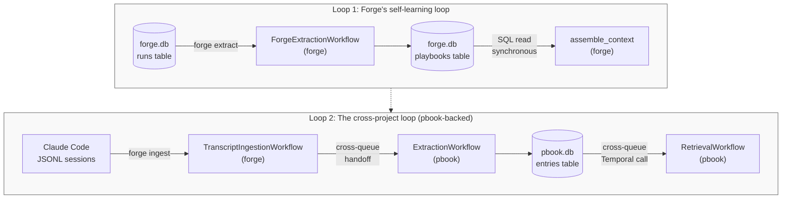
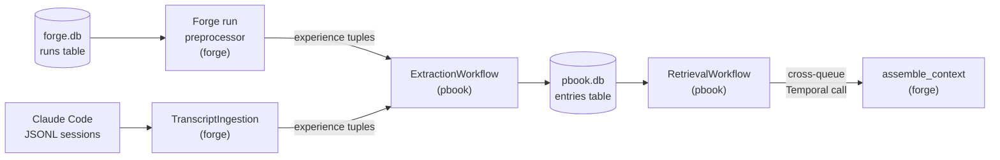

# Learning Loops

Prerequisites: [Forge Run Extraction](forge-run-extraction.md), [Transcript Ingestion](transcript-ingestion.md).

Forge has two separate knowledge-accumulation pipelines today, and the split is technical debt. This topic covers the whole story: what each pipeline does, how their schemas diverged, why they haven't been unified, and what unification would look like as a concrete refactor. If you only need to understand one pipeline in isolation, read its own topic instead.

## The problem LLM orchestrators don't solve by default

An LLM call is stateless. Send a prompt, get a response, throw the conversation away. When the next task arrives, the model has no memory of what it learned last time. If a validation check failed yesterday because a Pydantic model was missing a `from __future__ import annotations` statement, the model will hit the same failure tomorrow unless something outside the model remembers.

Most orchestrators address this by accumulating long conversation histories or by asking the model to "reflect" on its own output. Forge does not, because forge is batch-first and stateless by design: every LLM call is a self-contained document completion with no conversation history. That design choice gives up one kind of memory (in-conversation) and makes another kind mandatory (out-of-band). The out-of-band memory is what learning loops provide.

A learning loop, in Forge's vocabulary, is any mechanism that observes past work, distills reusable lessons, and injects those lessons into future task contexts. The distilled lessons are called *playbook entries*. Both of Forge's learning loops produce playbook entries; the differences are in the source of observation, the storage backend, and the retrieval path.

## Two loops today

Forge currently runs two parallel learning loops that do not share code, storage, or lifecycle.

The first loop is **Forge's self-learning loop**. Forge records every task it runs in its SQLite observability store. Running `forge extract` triggers `ForgeExtractionWorkflow`, which reads unextracted runs, asks a summarization-tier LLM to distill reusable lessons from them, and writes those lessons to forge's own `playbooks` table. When a new task runs, the `assemble_context` activity does a synchronous SQL read against that table to inject matching entries into the prompt. The entire loop is self-contained inside forge: forge writes the entries, forge reads them, forge's own run history is the only source. This is covered in detail in [Forge Run Extraction](forge-run-extraction.md).

The second loop is **the cross-project loop**, and it is backed by [pbook](https://github.com/sax-capital/pbook) — a separate service forge talks to via Temporal cross-queue calls. Forge's `TranscriptIngestionWorkflow` reads a Claude Code JSONL session file, renders it to text, asks the batch API to extract structured problem/resolution tuples, and then calls pbook's `ExtractionWorkflow` cross-queue with those tuples. Pbook does the actual playbook creation: it deduplicates, computes embeddings, flags entries for human review, and writes them to its own `entries` table in its own database. Retrieval goes the other way — whoever wants to consume pbook entries calls pbook's `RetrievalWorkflow` cross-queue, which ranks candidates by tag overlap and intent mode and packs them into a token budget. This is covered in detail in [Transcript Ingestion](transcript-ingestion.md).

The key observation is that these two loops do not meet anywhere. Forge's context assembly reads `forge.db`'s `playbooks` table. It does not read pbook's `entries` table. Nothing in pbook reads forge's `playbooks` table. The two databases are entirely independent. A lesson that forge extracts from a completed forge run cannot be retrieved by any project except forge itself. A lesson that pbook accumulates from a Claude Code transcript is invisible to forge's own context assembly.

## The schemas diverged

Forge's playbook table is older and simpler than pbook's entries table. They store the same conceptual thing — a titled, tagged lesson with some source provenance — but the pbook schema accumulated features that forge's never grew.

| Field | forge `playbooks` | pbook `entries` |
|---|---|---|
| `id` | ✓ | ✓ |
| `title` | ✓ | ✓ |
| `content` | ✓ | ✓ |
| `tags_json` | ✓ | ✓ |
| `created_at` | ✓ | ✓ |
| `updated_at` | — | ✓ |
| `source_task_id` | ✓ | ✓ |
| `source_workflow_id` | ✓ | — |
| `extraction_workflow_id` | ✓ | — |
| `source_project` | — | ✓ |
| `entry_type` | — | ✓ (`pitfall`, `curated`) |
| `needs_review` | — | ✓ |
| `helpful_count` | — | ✓ |
| `harmful_count` | — | ✓ |
| `retrieval_count` | — | ✓ |
| `embedding` | — | ✓ (OpenAI `text-embedding-3-small`) |

Forge carries two source-tracking fields (`source_workflow_id`, `extraction_workflow_id`) that pbook does not; pbook carries a much larger set of quality-and-feedback fields that forge does not. The pbook schema is strictly better in the fields that matter for a curated knowledge base: embeddings enable semantic search and semantic deduplication, feedback counters let retrieval down-rank entries that keep getting marked harmful, the `needs_review` flag supports a human-in-the-loop quality gate, and `retrieval_count` lets the maintenance workflow prune entries that nobody ever consumes.

None of those features are fundamental to pbook. Forge could have had them too. It doesn't, because forge's extraction pipeline was built first, when forge was a standalone system with no external knowledge store, and nothing has since gone back and upgraded the schema.

The extraction prompts also diverged. Forge's prompt is permissive — it asks for multiple categorized entries per batch and accepts entries that merely restate the task description. Pbook's prompt is much stricter, explicitly instructing the model that it is better to extract nothing than to extract something generic. Pbook emphasizes the "unexpected + actionable" quality bar; forge accepts "anything worth remembering." Pbook's bar is the right one and forge's should converge to it.

## Why the two loops are separate today

Part of the separation is genuine and part of it is an artifact.

**The genuine part is the input schema.** Forge's extraction runs on *forge run records*, which carry rich internal telemetry that pbook's simple `PushExperienceInput` tuple cannot represent. A forge run record contains the task description, the assembled context (files, imports, validation results, prior playbooks), the LLM response (files written, explanation), validation outcomes (which checks passed or failed with what errors), and the full retry history (how many attempts, what error feedback was injected each time). The extraction LLM reasons over that entire trace. A `PushExperienceInput` flattens everything down to `(problem, resolution, context, metadata)` — a single problem/resolution pair. If you piped forge runs through pbook's current workflow, you would have to collapse the run trace into one problem/resolution pair before the LLM ever saw it, losing the ability to cross-reference which validation failed alongside which missing context. That is a real information-loss boundary, not a refactoring inconvenience.

**The genuine part is the retrieval hot path.** Forge's `assemble_context` reads playbooks synchronously as part of task execution. Every task does this read. It is a SQLite query against a local database — a handful of milliseconds. Pbook's `RetrievalWorkflow` is a cross-queue Temporal workflow call. It crosses a process boundary, goes through the Temporal server, runs as a separate workflow, and calls activities on a different worker. The latency profile is different by orders of magnitude. Moving forge's context assembly to call pbook's retrieval would put a cross-queue round-trip on every task, and that cost would compound with every retry, every exploration round, and every sub-task fan-out.

**The artifactual part is everything else.** The schema divergence, the duplicate extraction activities, the separate storage, the two different prompts with two different quality bars — none of that is load-bearing. It exists because the two systems were built at different times for different reasons and nobody has gone back to reconcile them. Forge's extraction predates pbook. When forge was a standalone tool, it made sense for forge to carry its own playbook store. When pbook was introduced as a cross-project knowledge service, the natural thing to do was to plug it in alongside forge's existing system, not to rip forge's out and replace it. The result is the two-loops reality you see today.

## What convergence would look like

A unified pipeline would keep the genuine parts (rich run records, fast retrieval) and remove the artifactual parts (duplicate extraction, divergent schemas, separate storage). Concretely:

1. **Forge-run-extraction becomes a source-specific preprocessor.** Instead of producing forge `PlaybookEntry` objects directly, it would produce richer experience tuples — something like an extended `PushExperienceInput` with additional fields for `validation_failures`, `retry_context`, and an `assembled_context_summary`. This step would still live in forge because only forge knows how to read forge run records, but its output would be in a shape pbook can consume.

2. **Pbook's `ExtractionWorkflow` becomes the shared extraction step.** It already runs for transcript ingestion. Under convergence, it would also run for forge-run extraction — receiving the richer experience tuples, doing the same deduplication, embedding, and quality review, and writing to the same `entries` table. The LLM prompt inside pbook's extraction would need to accept the extended fields, but the workflow structure would not change.

3. **Forge's `playbooks` table is deleted.** Its rows migrate to pbook's `entries` table with an `entry_type` of something like `forge-run-lesson`. The Alembic migration is straightforward because pbook's schema is a superset.

4. **Forge's context assembly reads from pbook via `RetrievalWorkflow`.** The synchronous SQL read becomes a cross-queue Temporal call. This is the expensive step — both in engineering effort and in runtime latency.

The shape of the unified pipeline matches your intuition if you look at it sideways: ingestion is the source-specific step (reading runs, reading transcripts, reading whatever comes next), extraction is the source-agnostic step. Forge's current extraction workflow is misnamed under that framing — it is actually doing both ingestion and extraction in one workflow. The refactor splits those concerns.

## The hard parts

Convergence is not free. Two costs in particular are load-bearing.

**Hot-path latency.** Every forge task reads playbooks during context assembly. Today that read is a local SQL query. Under convergence, it becomes a cross-queue Temporal workflow call to pbook's `RetrievalWorkflow`. Temporal workflow calls are not cheap — they involve scheduling, task queue lookup, worker polling, activity execution, and serialization. The additional latency per task is not catastrophic, but it compounds: planned tasks do one context assembly per step, fan-out tasks do one per sub-task, exploration rounds do one per round, and retries repeat the whole chain. For a task that ends up with ten assembled contexts across planning, execution, and retries, ten cross-queue calls per task is a different latency budget than ten SQLite reads. This might be acceptable. It might require caching. It might require pushing pbook entries into forge's local store as a read-through cache. These are solvable, but they are not free, and none of the options are free.

**Operational coupling.** Today forge can run without pbook. The worker starts, the store is self-contained, and if pbook is unavailable the only feature that breaks is transcript ingestion (and even that degrades gracefully — the optional-dependency guards in `worker.py` skip the ingestion workflow registration when pbook is not importable). Under convergence, forge's task execution would depend on pbook's retrieval workflow being reachable. If pbook is down or its database is corrupted, forge's context assembly either fails or silently drops playbooks on every task. The convergence path has to include a story for graceful degradation, and that story has to be more sophisticated than "try/except and log a warning," because silently dropping playbooks turns playbook retrieval from a tunable feature into a silent correctness regression.

**Information loss at the tuple boundary.** This is the most subtle cost. If the extended experience tuple does not faithfully represent everything a forge run record contains, the extraction LLM sees less than it sees today, and the quality of extracted lessons drops. The design of the extended tuple shape is therefore load-bearing, and it cannot be rushed. Extending `PushExperienceInput` with a few extra fields is the easy part; deciding which fields preserve enough of the run trace to match today's extraction quality is the hard part.

## What this means for a reader today

Both pipelines exist. Neither is going away soon. When you run `forge extract`, you are invoking forge's self-learning loop and writing to forge's own store. When you run `forge ingest`, you are invoking the cross-project loop and writing to pbook's store. The two stores contain different entries and are retrieved by different code paths. If you want forge to learn from its own runs, use `forge extract`. If you want to build up a cross-project knowledge base from Claude Code session histories, use `forge ingest`.

Do not assume that a lesson captured in one store is visible from the other. It isn't. If you manually add an entry via `forge playbooks add`, it lands in forge's store and only forge's tasks will see it. If you add an entry via `pbook add`, it lands in pbook's store and forge's own tasks will not retrieve it at all. This is confusing and should eventually be fixed.

The convergence refactor sketched above is the known design trajectory, not a shipped feature. The two pipelines will be unified when the cost/benefit works out — when someone has the latency budget for a cross-queue hot path, or has a caching story that makes the latency a non-issue, and when the design of the extended experience tuple has been thought through carefully enough that forge's extraction quality doesn't regress.

For how pbook's playbook entries are injected into forge's prompts today, see [Context Assembly](context-assembly.md) — noting that only forge's own playbooks participate in that injection, not pbook's.
