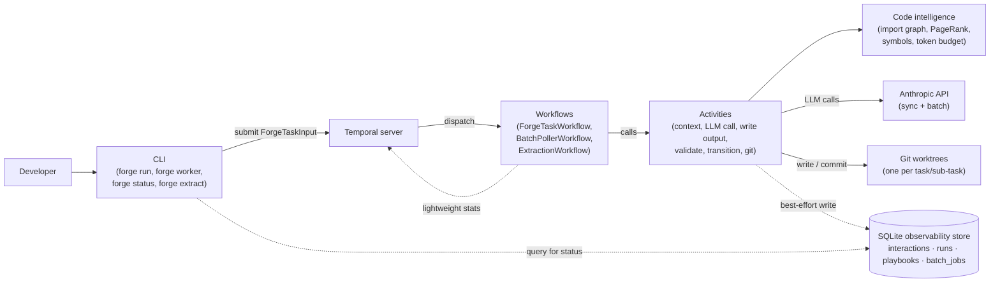

+++
title = "System Overview"
weight = 11
description = "What Forge is, the core principles that drive its design, and how the major components fit together."
topic = "system-overview"
covers = [
    "What problem Forge solves and why it exists",
    "The batch-first, document-completion paradigm vs. chat-based orchestrators",
    "The seven architecture principles and their practical consequences",
    "How the major components relate: CLI, Temporal workflows, activities, code intelligence, observability store",
    "The concept of task-agnostic orchestration — same pipeline, different prompts",
    "Plan-then-execute model vs. future dynamic task evolution",
]
detail = "High-level orientation piece. A developer reading this should come away with a mental map of the system — what the moving parts are, what philosophy connects them, and where to look for details. No code, no CLI commands. Diagrams showing component relationships are encouraged."
+++
Prerequisite: Basic familiarity with [Temporal](https://docs.temporal.io/) and LLM APIs.

Forge is a batch-first LLM task orchestrator. It decomposes tasks into independent work units, executes each as a single-step state machine transition, and reconciles the results. This document explains what problem Forge solves, what design principles shape it, and how its major components relate to each other.

For technical details on modules, environment variables, and the technology stack, see the [System Overview Reference](../reference/system-overview/).

## The problem Forge addresses

Most LLM orchestrators follow a chat-loop pattern: the model decides when to call tools, when to stop, and what to do next. The orchestrator is a thin wrapper around a conversation. This works for interactive use, but it couples execution to a live connection, makes each call dependent on the conversation history that precedes it, and leaves the LLM in control of the workflow.

Forge inverts this relationship. The orchestrator -- not the LLM -- owns the control loop. It decides what context to assemble, which model to call, whether to retry, and when to fan out to parallel sub-tasks. The LLM is a stateless function: it receives a complete prompt and returns a structured response. Nothing more.

This inversion has a specific, practical motivation: compatibility with batch APIs. Batch APIs (such as the [Anthropic Batch API](https://docs.anthropic.com/en/docs/build-with-claude/batch-processing)) accept requests as a queue and return results later, often at a 50% cost reduction. They do not support multi-turn conversations or streaming. A system where every LLM call is a self-contained document completion can use batch APIs without modification. A system built around chat loops cannot.

## Document completion, not chat

Every LLM call in Forge is structured as a **document completion**. The orchestrator assembles a complete document -- a system prompt containing all context the model needs, and a short user prompt describing what to produce -- then sends it as a single request. The model responds with structured output (via tool use), and the orchestrator evaluates the result.

This is the same pattern regardless of what the model is doing: generating code, decomposing a task into a plan, resolving a file conflict between parallel sub-tasks, or extracting lessons from a completed run. The prompt content changes; the execution pattern does not. This is what makes the architecture task-agnostic -- code generation, research, analysis, and documentation are all instances of the same primitive with different prompts and context.

For a detailed treatment of this central abstraction, see [The Universal Workflow Step](workflow-step/).

## The seven architecture principles

Forge's design follows seven principles. Each has concrete consequences for how the system behaves and what constraints it imposes on changes.

### Batch-first

The system is designed to operate in batch mode, with orchestration handled by Temporal workflows. Every LLM call must be a self-contained document completion because batch APIs do not support multi-turn conversations. Any proposed change that requires synchronous, interactive, or low-latency LLM calls must be evaluated for batch compatibility before proceeding.

The consequence is pervasive: prompt construction must be complete before the call is made, conversation history cannot accumulate across calls, and the exploration loop (where the LLM requests additional context) uses separate document completions for each round rather than appending to a running conversation.

### Deterministic work should be deterministic

The LLM should reason and generate, not gather information the system can compute. File listings, import graphs, PageRank scores, token budgets, validation results -- all of these are pre-calculated and included in the prompt as facts. The LLM never needs to "figure out" what files exist or what a module exports. This reduces hallucination risk, saves tokens, and makes the system's behavior reproducible.

The enforcement point is context assembly. The `assemble_context` activity computes everything it can before constructing the prompt. When something cannot be pre-computed (because the LLM needs to decide what to look at), the exploration loop handles it -- but even there, the actual lookups are performed by deterministic provider functions, not by the LLM.

### Context isolation is a feature

Each task receives a tightly constrained definition of "done" and a customized context assembled fresh for each request. There is no shared conversation history. There is no accumulated state from prior calls. Each LLM invocation sees exactly what it needs and nothing more.

This matters for two reasons. First, it prevents context pollution -- errors or irrelevant information from one call cannot leak into another. Second, it makes each call independently testable and observable. You can inspect the exact prompt that produced a given output without reconstructing a conversation history.

### Planning is the hard part

The planner receives the most expensive models (reasoning tier) and the highest token budgets. Everything downstream is bounded by plan quality: a plan that assigns overlapping file scopes to parallel sub-tasks will cause conflicts at gather time; a plan that misses a dependency will cause validation failures. Investing in planning reduces total cost by avoiding expensive retries and conflicts later.

This principle is why model routing exists as a first-class concept. The planner and conflict resolution use the reasoning tier. Code generation uses the generation tier. Exploration and transition evaluation use the classification tier. Matching capability to need is how the system manages cost.

### Halt when confused

When the orchestrator encounters a situation it cannot classify, it stops and escalates to a human. It does not guess. It does not retry with a different strategy. It produces a structured report explaining what happened and what it could not resolve, then waits.

The rationale is asymmetric risk: the cost of continuing with a bad plan (wasted tokens, divergent branches, silently wrong output) is higher than the cost of pausing. There are two escalation types: a "confused halt" (the result is unclassifiable, immediate stop) and a "degraded halt" (anomalous metrics like high retry rates, softer notification with the option to continue).

### The LLM call is the universal primitive

Every operation -- code generation, planning, exploration, conflict resolution, knowledge extraction, sanity checking -- is an instance of the same five-phase pattern: construct message, send, receive, serialize, transition. The differentiation between task types lives in the prompt and context, not in the workflow machinery.

This means adding a new task type does not require new workflow code. It requires new prompts, possibly new context sources, and possibly new validation criteria. The orchestration layer is unchanged. For a detailed explanation of this pattern, see [The Universal Workflow Step](workflow-step/).

### Follow Temporal best practices

Temporal provides durable execution, retry semantics, child workflows, signal handling, and workflow visibility. Forge uses these capabilities rather than reimplementing them. Workflows are deterministic (no randomness, no I/O, no network calls). Activities perform all side effects. Child workflows handle fan-out. Signals handle batch result delivery. These are not arbitrary choices -- they follow [Temporal's guidance](https://docs.temporal.io/best-practices) on how to build reliable distributed applications.

## How the major components fit together

Forge has five major component groups. Understanding their relationships provides a mental map for navigating the codebase.

The dashed lines carry observability and status traffic; the solid lines carry the control and output path. The separation matters: a failure on a dashed-line write never blocks the solid-line flow.

### CLI

The CLI (`forge run`, `forge worker`, `forge status`, `forge extract`, etc.) is the user's entry point. It constructs a `ForgeTaskInput`, submits it to the Temporal server, and optionally waits for the result. The CLI also queries the observability store for inspection commands. It does not contain orchestration logic -- it is a thin client that talks to Temporal and SQLite.

### Temporal workflows

The workflows are the orchestration layer. The main workflow (`ForgeTaskWorkflow`) implements the three execution modes: single-step, planned multi-step, and fan-out/gather. It sequences activities, handles retries, dispatches child workflows for parallel sub-tasks, and evaluates transition signals. The batch poller workflow (`BatchPollerWorkflow`) monitors submitted batch jobs and delivers results via Temporal signals. The extraction workflow (`ExtractionWorkflow`) runs knowledge extraction on its own schedule.

Workflows contain no I/O, no LLM calls, and no file system access. They are pure orchestration logic that calls activities.

### Activities

Activities are where work happens. Context assembly reads files and computes import graphs. The LLM call sends requests to the Anthropic API. Output writing applies edits to files in worktrees. Validation runs ruff and test suites. Git activities manage worktrees, branches, and commits. Each activity has its own timeout and retry policy, and each is independently testable.

The activity boundaries align with the five phases of the universal workflow step: construct (context assembly), send (LLM call), receive and serialize (output writing), validate (deterministic checks), and transition (signal evaluation).

### Code intelligence

The `code_intel` package provides import graph analysis (via grimp), PageRank ranking (via networkx), symbol extraction (via Python's ast module), token budget packing, and repository structure mapping. These are the deterministic analysis tools that feed context assembly. They implement the "deterministic work should be deterministic" principle -- pre-computing structural facts about the codebase so the LLM does not have to discover them.

### Observability store

The SQLite store persists full LLM interaction data: assembled prompts, model responses, token usage, latency, and context assembly statistics. This is separate from Temporal's workflow results, which carry only lightweight statistics. The separation exists because Temporal has a ~2MB payload limit, and a multi-step workflow can easily produce 2MB of prompts alone.

The store follows a best-effort write policy: store failures never block workflow execution. Observability is secondary to task completion.

## Task-agnostic orchestration

A recurring theme in Forge's design is that the pipeline is the same for every task type. Code generation, research, analysis, documentation, and review all flow through the same workflow, the same activities, and the same context assembly logic. The differentiation is in the **domain configuration**: a set of prompts, validation defaults, and context preferences that parameterize the pipeline for a specific kind of work.

This means extending Forge to a new task type is a matter of defining a new domain -- writing role prompts, output requirements, and validation criteria -- not building new workflow machinery. The orchestration layer does not know or care what the LLM is producing. It knows how to assemble context, call a model, apply structured output, validate results, and decide what to do next.

## Plan-then-execute today, dynamic evolution deferred

Forge commits to a plan upfront. When `--plan` is set, the planner decomposes the task into ordered steps once, and those steps execute as written. Steps do not discover new work mid-run. Sub-tasks do not re-plan. A running step that hits an ambiguous situation halts and escalates rather than deciding to branch into parallel exploration on its own. The universal workflow step's three outcome signals — `SUCCESS`, `FAILURE_RETRYABLE`, `FAILURE_TERMINAL` — are the entire vocabulary the orchestrator needs for this model, because there is no pathway for a step to grow new work.

The design document specifies three additional signals for a future dynamic-evolution model: `new_tasks_discovered` (a running step identifies work the planner missed), `blocked_on_human` (a step needs input to proceed), and `blocked_on_sibling` (a step depends on another sub-task's output that has not arrived). None are implemented. The current system handles those situations through the plan-then-execute boundary instead: upfront planning eliminates task discovery, `FAILURE_TERMINAL` is the human-escalation path, and dependency ordering in the plan prevents sibling-blocking.

This is an explicit trade-off. Plan-then-execute is easier to reason about, easier to observe, and easier to make batch-compatible — every LLM call's prompt is known before the run starts, so batch submission can pipeline everything the planner produces. Dynamic evolution buys flexibility at the cost of all three properties. When the planning-is-the-hard-part principle holds, the plan-then-execute model wins the comparison; when it stops holding, the deferred signals become interesting. See [The Universal Workflow Step](workflow-step/) for the full transition-signal reference and how the deferred signals are documented.

## What comes next

To see the universal workflow step in action, follow the [Golden Path Tutorial](../tutorials/golden-path/), which walks through a planned task from submission to committed output. For a deeper treatment of the five-phase pattern and why it matters, see [The Universal Workflow Step](workflow-step/).
