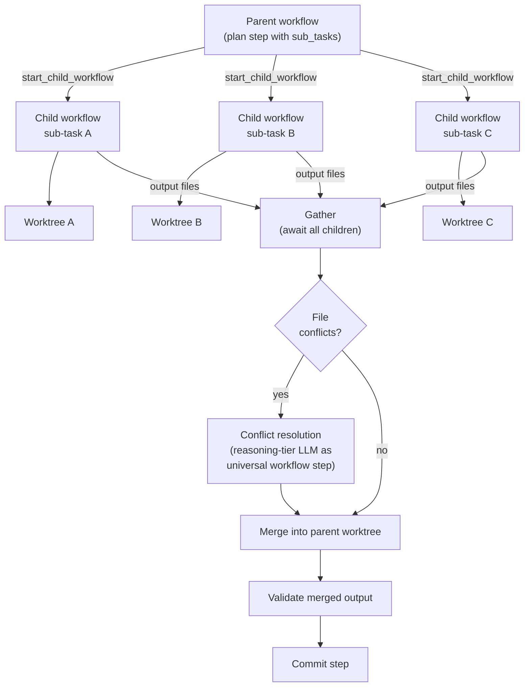

+++
title = "Task Decomposition and Execution"
weight = 61
description = "How Forge decomposes tasks into steps and sub-tasks, the three execution modes, and how fan-out/gather achieves parallelism."
topic = "task-decomposition"
covers = [
    "The three execution modes and when to use each (single-step, planned, fan-out)",
    "How the planner decomposes a task into ordered steps — what inputs it receives, what it produces",
    "Why planning gets the most expensive models and highest token budgets",
    "How fan-out dispatches parallel child workflows in separate git worktrees",
    "How gather collects results, detects file conflicts, and resolves them",
    "Nested fan-out: recursive decomposition bounded by max_fan_out_depth",
    "Sanity checks: periodic re-evaluation of the remaining plan",
    "Git strategy: worktree-per-task isolation, human-gated merges, disposable worktrees",
    "How the final result is assembled from gathered sub-task outputs",
]
detail = "Explain the full lifecycle of a task from submission to final committed result. Cover the 'task decomposition and gathering' and 'how a final answer is created' questions from the user's original request. Use diagrams showing the planner output, step execution, and fan-out/gather flow."
+++
Forge supports three execution modes for processing tasks, each built on the same [universal workflow step](workflow-step/). The choice of mode determines how much decomposition occurs before execution begins and whether work runs sequentially or in parallel. This document explains how tasks are decomposed, how parallel sub-tasks are gathered and reconciled, and how git worktrees provide isolation throughout.

## The Three Execution Modes

### Single-step

Single-step is the default mode. The task runs as a single LLM call: assemble context, call the model, write output, validate, commit. One worktree is created per attempt. On a retryable failure, the worktree is destroyed and a fresh one is created for the next attempt, with the previous error injected into the prompt.

Single-step is appropriate when the task is focused -- a change to one or two files where the LLM can produce the correct output in a single pass. There is no planning overhead, so turnaround is fast.

### Planned multi-step

When a task spans multiple files or requires ordered changes where later work depends on earlier results, planned mode decomposes the task into a sequence of steps before any execution begins. A planning LLM receives the full task description, target files, repository structure, and context, then produces an ordered list of steps. Each step specifies its own target files, description, and optional context.

Execution proceeds sequentially within a single shared worktree. Each step runs the universal workflow step and commits on success. If a step fails validation, uncommitted changes are reset (preserving commits from prior steps) and the step retries with the error context included. Later steps see the files created or modified by earlier steps because they share the same worktree.

The key property of planned mode is that the planner makes all decomposition decisions upfront. This is a deliberate design choice -- it follows the plan-then-execute model where the full scope of work is known before execution starts. Steps do not discover new work or re-plan during execution. If the plan becomes stale as steps complete, a separate sanity check mechanism (described below) can revise the remaining steps.

### Fan-out / gather

Fan-out is an extension of planned mode. When the planner identifies work within a step that can proceed independently -- for example, writing unit tests for three unrelated modules -- it declares sub-tasks on that step. Each sub-task runs as a Temporal child workflow in its own git worktree, executing in parallel. After all children complete, the parent gathers and merges their output.

Fan-out is appropriate when a step contains genuinely independent units of work that do not share context expensive to reconstruct. If sub-tasks would need to read each other's output, they belong in sequential steps instead.

## Why Planning Gets Premium Resources

Planning is the most consequential LLM call in the entire pipeline. A plan that misidentifies file boundaries, orders steps incorrectly, or fails to anticipate conflicts produces cascading failures downstream -- each step retries, worktrees are recreated, and token budget is spent on work that was doomed from the start.

For this reason, the planner always uses the reasoning capability tier (the most capable model available). It also receives extended thinking tokens so it can reason through the decomposition before committing to a plan. The rationale is that a few thousand extra tokens spent on planning save orders of magnitude more tokens on failed execution attempts.

The planner receives a rich context: the full task description, repository structure ranked by structural importance, target file contents, project conventions, and any relevant playbooks from prior tasks. The exploration loop runs before the planning call as well, so the planner can request additional context (file reads, code search, import graphs) before deciding how to decompose the task.

### What the planner produces

The planner produces a `Plan`: an ordered list of named steps plus an explanation of the decomposition strategy. Each step carries enough information for the executor to run it independently — what files it will touch, what context it needs beyond auto-discovery, whether it should fan out into parallel sub-tasks, and an optional capability-tier override for steps complex enough to deserve a stronger model than the default. The plan's explanation is recorded in the observability store so a human reviewing the run can see not just what the planner decomposed the task into, but why. For the exact field definitions on `Plan`, `PlanStep`, and `SubTask`, see the [task decomposition reference](../reference/task-decomposition/).

## Fan-Out Mechanics

Fan-out exists to exploit parallelism when sub-tasks are genuinely independent — writing tests for three unrelated modules, researching three parts of a design question, documenting three APIs. The parent workflow hands each sub-task to a Temporal child workflow running in its own git worktree, branched from the parent's current branch (not from `main`) so every child sees the results of prior committed steps. The children start concurrently and each runs the universal workflow step end to end with its own retry budget. Crucially, children do not commit. They produce output files that are returned to the parent, and the parent owns the commit.

The parent awaits all children. If any child terminally fails, the whole step fails — fan-out is atomic at the gather point. Otherwise, the parent collects each child's outputs and looks for file conflicts, which happen when two sub-tasks produce content for the same path. Conflict resolution is itself an instance of the universal workflow step: a reasoning-tier LLM receives the conflicting versions, the step description, and the sub-task descriptions, and emits a merged file. That response goes through the same write–validate–transition machinery as any other LLM call. This is the reason conflict resolution is not a bespoke merge algorithm — it is the planner's own universal primitive applied to a narrower problem.

Once conflicts are resolved (or if there were none), the parent writes the merged result to its worktree, validates the combined output, and commits. Validation is deliberately run on the merge, not on the individual children, because correctness is a property of what lands in the tree. Sub-task validation would catch only issues internal to each sub-task's output.

Fan-out can recurse. A sub-task may itself declare sub-tasks, creating nested fan-out. The recursion depth is bounded by a configurable maximum — flat fan-out is the default, with each additional level adding coordination overhead and more chances for conflict. Nested fan-out matters when a sub-task is itself large enough to benefit from further parallelism; in practice, flat fan-out covers most cases.

## Sanity Checks

In planned mode, the planner commits to a full decomposition before any execution begins. As steps complete, the assumptions behind the original plan may become stale -- an early step might have restructured files in a way that invalidates later steps, or validation failures might reveal that the approach needs adjustment.

Sanity checks address this by periodically re-evaluating the plan. When enabled, a reasoning-tier LLM reviews the completed step results and remaining steps after every N completed steps and decides whether the plan still holds, needs revision, or should be abandoned. Continuing runs the remaining steps as-written; a revision replaces them with new steps the LLM provides; an abort halts the task with a structured explanation. The three-outcome shape matches the workflow step's own transition vocabulary — sanity-checking is another application of the universal pattern, not a new control structure. For the exact verdict names and their effects, see the [task decomposition reference](../reference/task-decomposition/).

Sanity checks are disabled by default (interval of 0). They add latency and token cost, so they are most useful for long plans (more than five or six steps) where mid-course correction is worth the investment.

## Git Strategy

Git worktrees are the isolation mechanism for all execution modes. Every task runs in its own worktree, separate from the main repository working directory.

### Worktree-per-task isolation

Each task-level workflow creates a worktree at `<repo_root>/.forge-worktrees/<task_id>` on a branch named `forge/<task_id>`. The worktree is branched from the specified base branch (usually `main`). Sub-tasks within fan-out steps create their own worktrees with compound IDs (e.g., `my-task.sub.analyze-schema`), branched from the parent task's branch so they see prior committed step outputs.

### Human-gated merges

Forge never auto-merges worktree branches into `main`. All merges are human-gated. The system produces results in isolated branches; a human reviews and decides whether to merge. This is a fundamental safety property -- the system cannot corrupt the main branch regardless of what the LLM produces.

### Disposable worktrees

Worktrees are treated as disposable. In single-step mode, on a retryable failure the worktree is destroyed and recreated from scratch for the next attempt. In planned mode, uncommitted changes within a step are reset while prior committed steps are preserved. Sub-task worktrees are removed after their output is collected by the parent.

This disposability simplifies the failure model. When something goes wrong, the worktree can be discarded without side effects on other tasks or the main repository. On repeated failure, the workflow halts and escalates to a human with a structured report of what went wrong.

## How the Final Result Is Assembled

The path from task submission to final committed result depends on the execution mode, but the end state is the same: a set of committed changes on a worktree branch, ready for human review.

In single-step mode, the result is a single commit containing the LLM's output after validation passes.

In planned mode, the result is a series of commits, one per step, representing incremental progress. Each commit is independently valid (it passed validation before being committed). A human reviewing the branch sees a clean history showing how the task was built up step by step.

In fan-out mode, each fan-out step produces a single commit containing the merged output of all sub-tasks. Sequential steps before and after the fan-out step produce their own commits. The resulting branch history interleaves sequential commits with gather-merge commits.

In all modes, the final `TaskResult` returned to the CLI includes the status, output files, validation results, step results (in planned mode), and aggregate statistics (token usage, latency, model calls). The worktree remains on disk for human inspection until explicitly removed.

## Further Reading

- [The Golden Path: A Planned Task End-to-End](../tutorials/golden-path/) -- a walkthrough of a planned task from submission to committed output
- [The Universal Workflow Step](workflow-step/) -- the five-phase pattern that every execution mode builds on
- [Task Decomposition Reference](../reference/task-decomposition/) -- data model fields, execution mode selection logic, CLI flags, and git worktree lifecycle details
