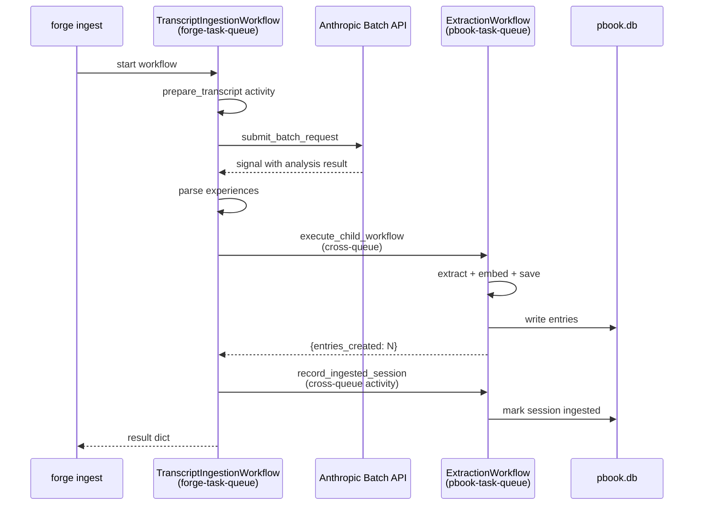

# Transcript Ingestion

Prerequisites: [Model Routing and Batch Processing](llm-dispatch.md), [Forge Run Extraction](forge-run-extraction.md).

Transcript ingestion is the pipeline that reads Claude Code JSONL session files, analyzes them with an LLM, and feeds the extracted experiences into [pbook](https://github.com/sax-capital/pbook) for storage. The pipeline lives partly in forge and partly in pbook. This document explains why that boundary exists, how the cross-queue handoff works, and how the two workflows on the forge side (`TranscriptIngestionWorkflow` and `BatchIngestionWorkflow`) relate to each other.

For technical details on workflow inputs, CLI flags, and cross-queue contracts, see the [Transcript Ingestion Reference](../reference/transcript-ingestion.md). For practical recipes, see [How to Ingest Transcripts](../howto/ingest-transcripts.md). For the bigger picture of why forge has two learning pipelines at all — and why their outputs land in different databases — see [Learning Loops](learning-loops.md).

## Why transcript ingestion lives in forge, not pbook

Pbook owns the playbook store. It is the system of record for cross-project lessons, it implements the deduplication and embedding logic, and it exposes the retrieval workflow. A reasonable person would ask why the thing that reads Claude Code transcripts and turns them into playbook-ready experiences doesn't also live in pbook.

The answer is that the expensive step is the LLM analysis, and forge is the system with the batch API infrastructure. Forge already owns the workflow machinery for submitting requests to the Anthropic Batch API, waiting on completion signals, and parsing the responses. That machinery is the `batch_submit_and_wait` pattern used everywhere else in forge. Building the same infrastructure inside pbook would duplicate work that has already been done once, and keeping the two copies in sync would be a maintenance burden that nobody is signing up for.

So the boundary falls along a natural line: forge does the LLM-heavy work because forge has the LLM infrastructure, and pbook does the storage-heavy work because pbook owns the store. What crosses the boundary is a small set of structured experience tuples — the output of forge's analysis, the input to pbook's extraction.

## The two workflows on the forge side

Forge defines two workflows for ingestion, and the distinction matters.

**`TranscriptIngestionWorkflow`** processes a single session end to end. It takes one JSONL path, calls an activity to parse and render the transcript, submits a batch API analysis request, waits for the result signal, parses the returned experiences, and hands them off to pbook's extraction workflow cross-queue. It also handles recording the session as ingested (so it does not get re-processed on the next run) and gracefully handles the edge cases of empty transcripts, small transcripts, and malformed LLM responses.

**`BatchIngestionWorkflow`** is a thin fan-out wrapper over `TranscriptIngestionWorkflow`. It takes a list of sessions, starts one child `TranscriptIngestionWorkflow` per session, gathers the results, and aggregates the counts. If one child fails, the others still run — errors are captured into the per-session result without bringing down the batch. The fan-out pattern mirrors the one forge uses elsewhere (sub-task fan-out in the main task workflow) and is the same Temporal primitive: `start_child_workflow` for each child, `await handle.result()` for each, with per-child error handling.

The split exists because `TranscriptIngestionWorkflow` is useful on its own for single-session ingestion from the CLI, while `BatchIngestionWorkflow` is what the `forge ingest --all` path uses to process every session discovered under `~/.claude/projects/`. Splitting the two keeps the single-session path clean and free of fan-out complexity, and keeps the fan-out workflow simple because it has nothing to do beyond starting children and gathering their results.

## Why the analysis uses the SUMMARIZATION tier and batch mode

The LLM call inside `TranscriptIngestionWorkflow` uses forge's batch dispatch path with the `SUMMARIZATION` capability tier. Both choices are deliberate.

The tier choice reflects the nature of the task. Transcript analysis is closer to summarization than to code generation — the model is reading a long conversation and producing a short structured list of unexpected problems and their resolutions. The `SUMMARIZATION` tier defaults to Sonnet, which is the right capability level for this task. Using `GENERATION` instead would work today because the tier also defaults to Sonnet, but if someone later overrides `ModelConfig.generation` to point at Opus for code generation, ingestion would accidentally get upgraded too. Pinning to `SUMMARIZATION` insulates ingestion from that risk.

The batch mode choice reflects the latency budget. Transcript ingestion is not interactive. Nobody is waiting in a terminal for the `forge ingest --all` command to complete in real time; in fact, `forge ingest --all` typically processes dozens of sessions and even a single synchronous call per session would take hours. The batch API accepts requests in bulk, runs them at a 50% cost discount, and returns results via the same signal pattern forge already uses for code-generation batch calls. For a background workload that can tolerate minutes or hours of latency, batch mode is strictly better than synchronous.

Because the workflow uses batch mode, it inherits the same waiting pattern as the rest of forge: submit the request, block on a `workflow.wait_condition` until a signal arrives, parse the result, continue. The `BatchPollerWorkflow` — which runs on a schedule and polls the Anthropic API for completed batches — delivers the completion signal to the waiting `TranscriptIngestionWorkflow` instances via their workflow IDs. The wait itself is cheap in Temporal: the workflow is paused with no memory or CPU cost until the signal arrives.

## The cross-queue handoff

Forge and pbook run separate Temporal workers on separate task queues. Forge's workflows and activities live on `forge-task-queue`; pbook's live on `pbook-task-queue`. The two queues are registered against the same Temporal server so workflows on either queue can invoke activities or child workflows on the other.

The handoff from forge's `TranscriptIngestionWorkflow` to pbook happens at two points. First, after the analysis LLM call has returned a list of experiences, the workflow invokes pbook's `ExtractionWorkflow` as a cross-queue child workflow:

The second cross-queue call is the `record_ingested_session` activity, which runs on `pbook-task-queue` and writes to pbook's `ingested_sessions` tracking table. This tracking is what prevents `forge ingest --all` from reprocessing the same session on every run: on the next invocation, the CLI queries pbook's tracking table and filters out any session that is already present, unless `--force` is passed.

The two workflows communicate only through structured Temporal data (JSON-serialized experience tuples on the way in, a small result dict on the way out). Neither side touches the other's database directly.

## Why two-worker isolation is the right boundary

It would be technically possible to run both forge's and pbook's workers on the same task queue and skip the cross-queue complexity. That would be a mistake for two reasons.

The first reason is graceful degradation. When pbook is unavailable — not installed, not running, or its database is broken — forge's main task execution should keep working. The two-worker split is what makes this possible: forge's worker registers only forge's workflows and activities, pbook's worker registers only pbook's, and if pbook's worker is down, only pbook-bound workflows fail. Forge's task execution continues to run because it never touches pbook's task queue. Forge's `worker.py` even guards the ingestion workflow registrations behind an `ImportError` check on pbook, so forge's worker starts cleanly even when pbook is not importable at all.

The second reason is operational separation. Pbook's extraction work is compute-intensive (LLM calls for review, embedding calls to OpenAI), while forge's task execution is also compute-intensive. Running both on the same worker would make capacity planning harder, and a spike in one would starve the other. Separate workers on separate task queues let each be scaled, throttled, and restarted independently.

## The information this pipeline loses

Transcript ingestion is lossy by design. The structured experience tuples that come out of the analysis step — `{problem, resolution, context}` — throw away most of the raw transcript. The LLM reads hundreds of turns of conversation and emits a handful of short, focused experience statements, or none at all if nothing in the transcript meets the quality bar. That lossiness is intentional: the goal is not to archive Claude Code sessions but to distill their reusable insights. The original JSONL file remains untouched on disk, and ingestion can be re-run with a different prompt or a different model if the analysis quality needs to change.

This is also why the system is forgiving of poor LLM output. If the analysis returns malformed JSON, the workflow logs the error and returns an empty result without crashing — the session is treated as "nothing worth extracting" rather than a hard failure. If the analysis returns zero experiences, the session is recorded as ingested with zero entries so it does not get reprocessed. The pipeline never commits garbage to pbook's store on the theory that an empty ingestion is always better than a wrong one.

## Why transcript ingestion produces pbook entries and not forge playbooks

Forge has its own playbook store, and its own extraction pipeline, which is covered in [Forge Run Extraction](forge-run-extraction.md). You might reasonably ask why transcript ingestion doesn't write to forge's store alongside forge's own extracted lessons.

The short answer is that forge's playbook store is scoped to lessons forge learned about forge runs, and transcript ingestion is about lessons from Claude Code sessions — which are typically *not* about forge at all. A session in which a developer was debugging a SQLAlchemy migration has nothing to teach forge's own task execution. It has a lot to teach pbook's cross-project knowledge base, which is designed to collect exactly that kind of lesson.

The longer answer involves the schema and retrieval differences between the two stores, which is the subject of [Learning Loops](learning-loops.md). The short version: pbook's store is richer (it has embeddings, feedback counters, and review flags), pbook's retrieval supports intent-based ranking, and pbook's model is cross-project by construction. Forge's store is simpler and self-contained. For Claude Code transcripts — which are external, cross-project data — pbook is the right destination. For forge's own run history, forge's store is the right destination. The two learning loops run in parallel today, and that parallelism is explained at length in the learning-loops topic.

For how the ingestion workflows are invoked and configured at the Python level, see the [Transcript Ingestion Reference](../reference/transcript-ingestion.md). For step-by-step commands, see [How to Ingest Transcripts](../howto/ingest-transcripts.md).
