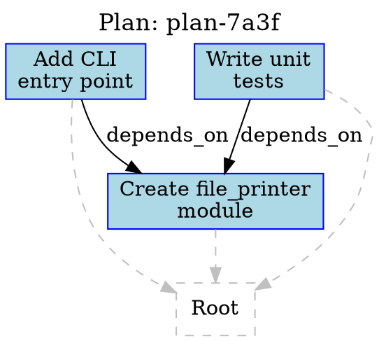

# Step 10: User Approval

- **Parent step:** step_0009
- **No LLM** — DOT generation + user signal
- **LLM calls:** 0
- **PlanDAG version:** -- (status change only)

## Action

Present the finalized PlanDAG to the user for approval. The user
receives:

1. The PlanDAG as formatted JSON (shown in
   [step_0009/llm_prompt.md](../step_0009/llm_prompt.md))
2. A rendered DOT diagram (below)
3. Summary statistics

## Summary Statistics

| Metric | Value |
|--------|-------|
| Total nodes | 4 (1 root + 3 leaves) |
| Leaf nodes | 3 |
| Estimated total steps | 3 |
| Workflow types | software |
| DEPENDS_ON edges | 2 |
| PARENT_CHILD edges | 3 |
| Judge rounds | 1 |
| Judge verdict | 3-of-3 APPROVE (unanimous) |

## DOT Diagram



## Execution Order

```
node-001 (Create file_printer module)
    |
    +---> node-002 (Add CLI entry point)      [parallel]
    +---> node-003 (Write unit tests)         [parallel]
```

## Decision

The Temporal workflow pauses via `workflow.wait_condition()` until the
user responds with "approve" or "reject" via signal. In this example,
the user approves.

## Outcome

- User approves the plan
- Plan status transitions from `"draft"` to `"approved"`
- The PlanDAG is ready for execution
- Leaf nodes will be translated into `ForgeTaskWorkflow` instances
  following the dependency order: node-001 first, then node-002 and
  node-003 in parallel
