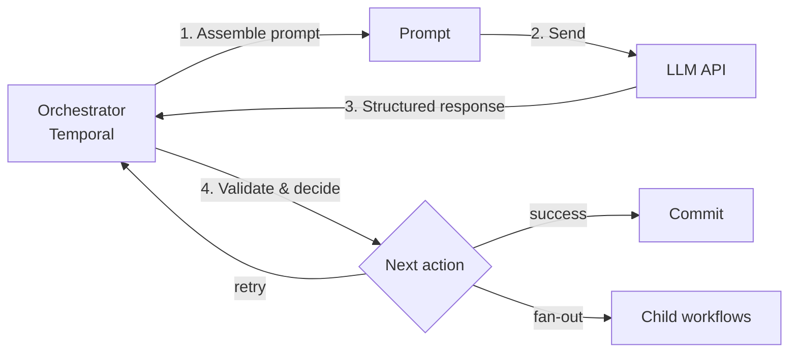
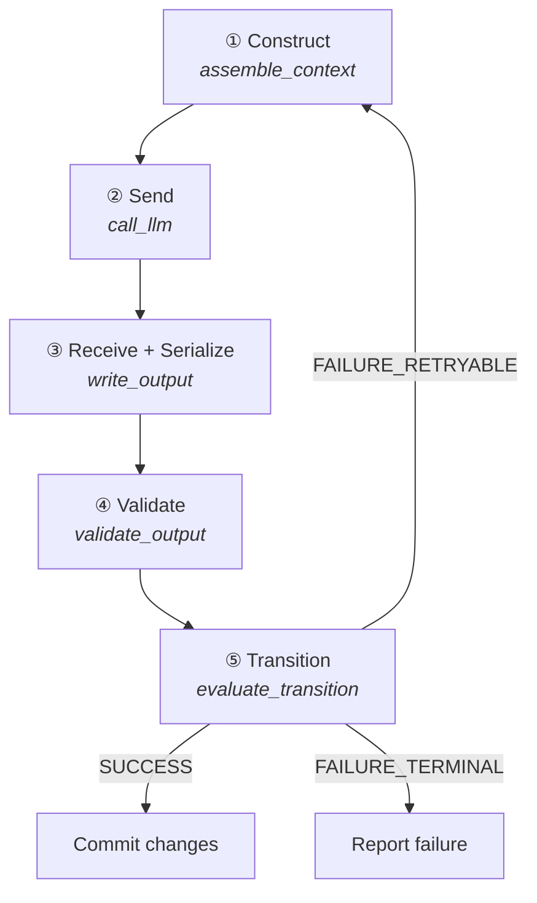
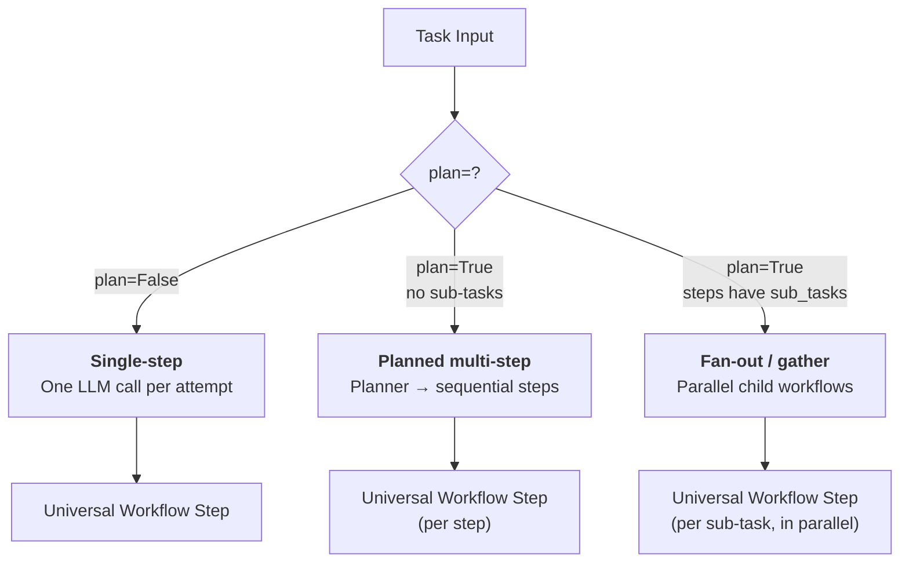
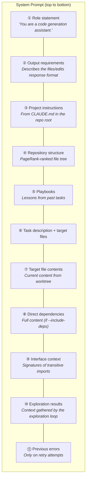
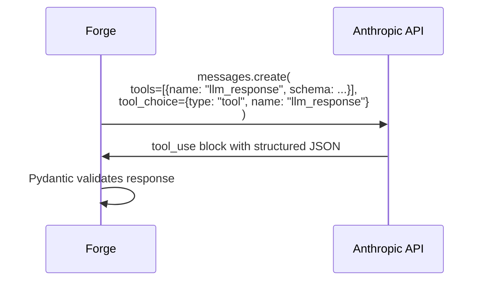
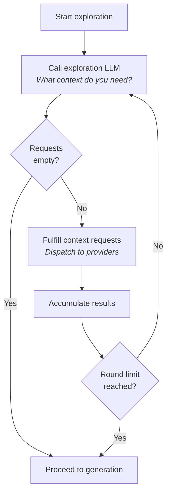
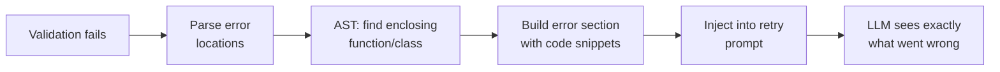
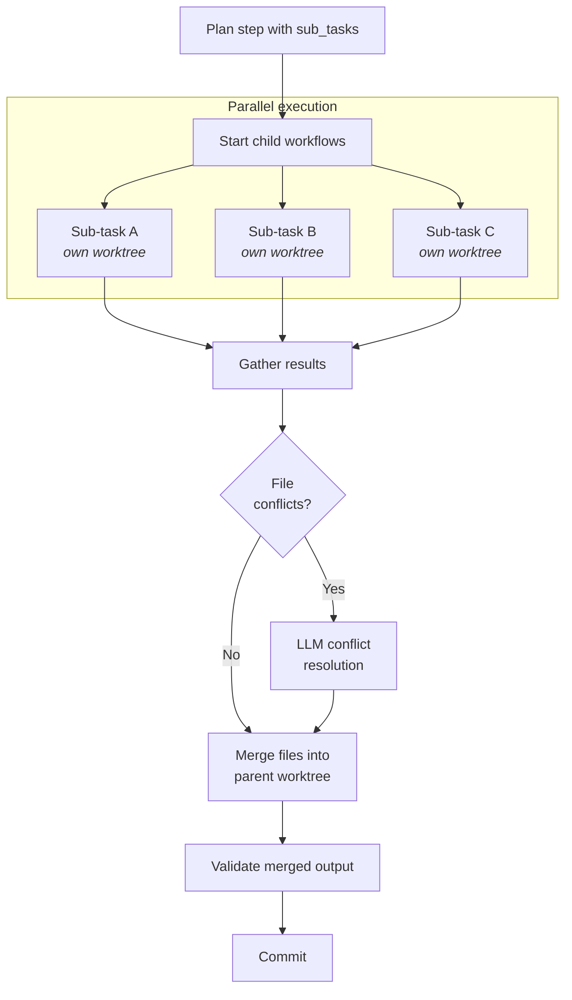
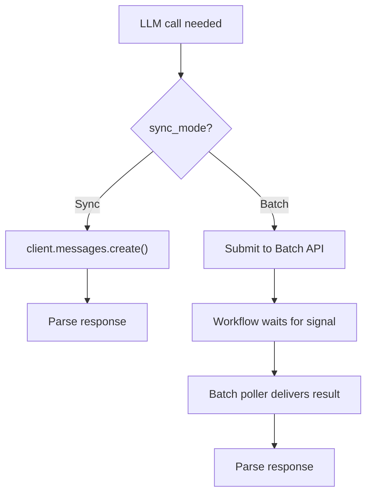
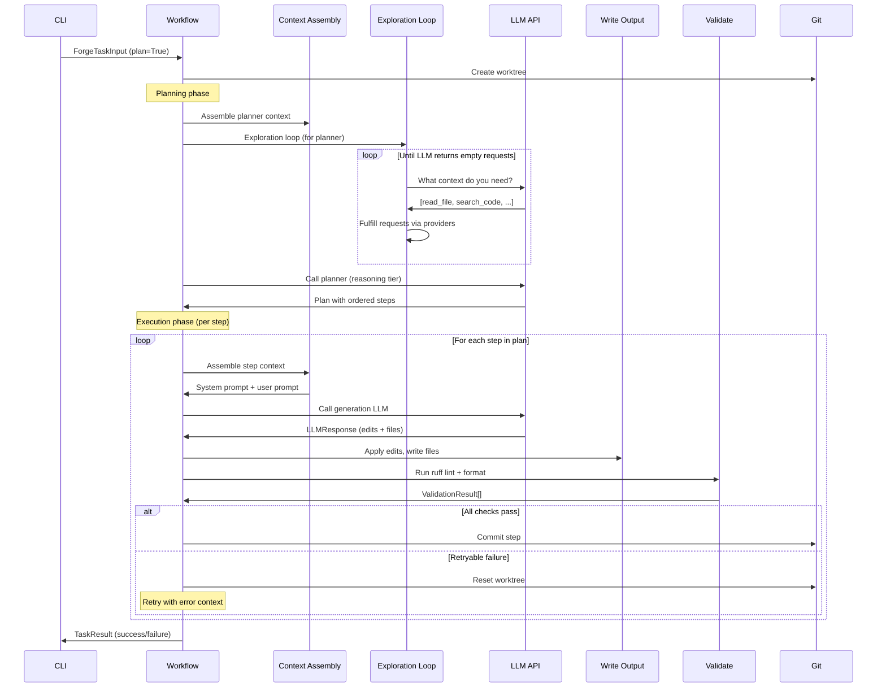

# Forge Architecture Overview

Forge is a batch-first LLM task orchestrator. It decomposes work into independent units, executes each as a structured document-completion request, validates the results with deterministic checks, and decides what to do next. Temporal provides the workflow engine; the LLM never owns the control loop.

This document explains how the system works end-to-end: the universal workflow step, how prompts are assembled, how the LLM "calls tools" without an agentic loop, and how fan-out parallelism works.

---

## Table of Contents

1. [Core Idea: Document Completion, Not Chat](#core-idea-document-completion-not-chat)
2. [The Universal Workflow Step](#the-universal-workflow-step)
3. [Execution Modes](#execution-modes)
4. [Context Assembly: Building the Document](#context-assembly-building-the-document)
5. [Structured Output: How the LLM Responds](#structured-output-how-the-llm-responds)
6. [Exploration: How the LLM "Calls Tools"](#exploration-how-the-llm-calls-tools)
7. [Error-Aware Retries](#error-aware-retries)
8. [Fan-Out / Gather](#fan-out--gather)
9. [Model Routing](#model-routing)
10. [Batch vs. Sync Execution](#batch-vs-sync-execution)
11. [Key Data Models](#key-data-models)
12. [Module Map](#module-map)

---

## Core Idea: Document Completion, Not Chat

Most LLM orchestrators run the model in a chat loop where the LLM decides when to call tools, when to stop, and what to do next. Forge inverts this. Every LLM call is a **single document completion**: the orchestrator assembles a complete prompt (system + user), sends it, receives a structured response, and evaluates the outcome. The orchestrator—not the LLM—decides whether to retry, what context to gather next, or when to fan out to parallel sub-tasks.

This design has a concrete benefit: every LLM call is stateless and self-contained, which makes it compatible with **batch APIs** (where requests are queued and results arrive later) and **local LLM tools** (where there is no streaming chat session). It also makes each call independently testable and observable.



---

## The Universal Workflow Step

Every operation in Forge—code generation, planning, exploration, conflict resolution—follows the same five-phase pattern:

```
Construct → Send → Receive → Serialize → Transition
```

Each phase is implemented as a separate Temporal **activity** (a unit of work with its own timeout and retry policy). The **workflow** orchestrates these activities in sequence.



### What happens at each phase

| # | Phase | Activity | What it does |
|---|-------|----------|-------------|
| 1 | **Construct** | `assemble_context` | Builds the system prompt and user prompt. Discovers relevant files via import graph analysis and PageRank ranking. Reads target file contents from the worktree. Injects project instructions, playbooks, repo maps, and—on retries—previous error output with AST-derived context. |
| 2 | **Send** | `call_llm` | Packages the assembled prompt into an Anthropic API `messages.create` call with a forced tool-use response schema. Sends it. Records latency and token usage. |
| 3 | **Receive + Serialize** | `write_output` | Extracts the Pydantic-validated response from the tool-use block. Writes new files to the worktree. Applies search/replace edits to existing files using a four-level matching fallback chain (exact → whitespace-normalized → indentation-normalized → fuzzy). |
| 4 | **Validate** | `validate_output` | Runs deterministic checks: `ruff` lint, `ruff` format, and optionally a test suite. Produces a list of pass/fail results with error details. |
| 5 | **Transition** | `evaluate_transition` | Maps validation results to a signal: `SUCCESS` (all checks pass), `FAILURE_RETRYABLE` (checks failed but attempts remain), or `FAILURE_TERMINAL` (no retries left or unrecoverable). |

---

## Execution Modes

Forge supports three execution modes. All three use the same universal workflow step internally.



### Single-step (`plan=False`)

The simplest mode. One worktree is created per attempt. The universal workflow step runs once. On success, changes are committed. On retryable failure, the worktree is destroyed and a fresh one is created for the next attempt, with the previous error output injected into the prompt.

### Planned multi-step (`plan=True`)

A planning LLM (using a higher-capability model) decomposes the task into an ordered list of steps. One shared worktree is created at the start. Each step executes the universal workflow step and commits on success. On retryable failure, uncommitted changes are reset (prior committed steps are preserved) and the step is retried with error context.

A **sanity check** can run periodically between steps: a reasoning-tier LLM reviews progress and remaining steps, and can issue `CONTINUE`, `REVISE` (rewrite remaining steps), or `ABORT`.

### Fan-out / gather (`plan=True`, steps with `sub_tasks`)

When a planned step contains sub-tasks, each sub-task is dispatched as a **child workflow** running in its own git worktree. All children execute in parallel. After all children complete, their output files are merged into the parent worktree. If multiple sub-tasks modify the same file, a conflict resolution LLM resolves the differences. The merged result is validated and committed.

Sub-tasks can themselves contain nested sub-tasks, bounded by a configurable `max_fan_out_depth`.

---

## Context Assembly: Building the Document

The prompt sent to the LLM is not a chat transcript—it is a structured document assembled from multiple sources. The `assemble_context` activity constructs a system prompt and a user prompt.

### System prompt structure

The system prompt is assembled in a specific order optimized for **prompt caching** (stable content first, volatile content last):



Sections ①–⑤ are **stable** across calls for the same repository and task, allowing the Anthropic API's prompt caching to avoid re-processing them on retries. Section ⑪ only appears on retry attempts.

### How context discovery works

When auto-discovery is enabled (the default), Forge builds context through these steps:

1. **Import graph analysis** — Uses `grimp` to build the project's import dependency graph.
2. **PageRank ranking** — Runs `networkx.pagerank` on the import graph to rank files by structural importance.
3. **Symbol extraction** — Uses Python's `ast` module to extract function signatures, class definitions, and constants from each file.
4. **Token budget packing** — A knapsack-style algorithm packs files into the token budget by priority: target files first (full content), then direct dependencies, then interface signatures of transitive imports, and finally the repo map.

By default, only target file contents and the repo map are included upfront. Dependency contents are omitted to keep prompts lean—the LLM can pull them on demand through the exploration loop.

### User prompt

The user prompt is short and domain-specific. For code generation:

> *"Generate the requested code changes. Use `edits` for existing files and `files` for new ones."*

For planned steps, it includes the step ID and description. The user prompt is intentionally minimal—all the substantive context is in the system prompt.

---

## Structured Output: How the LLM Responds

Forge uses Anthropic's **tool use** feature to get structured output. Instead of parsing free-form text, the LLM is forced to call a tool whose input schema is a Pydantic model. This guarantees the response is valid JSON matching the expected shape.



The `LLMResponse` schema has three fields:

- **`explanation`** — Free-text reasoning about what was done.
- **`files`** — New files to create (path + complete content).
- **`edits`** — Changes to existing files (path + list of search/replace pairs).

A file path may appear in `files` or `edits`, but not both.

### Edit application

Edits use a search/replace model: the LLM provides an exact string to find and a replacement string. To tolerate minor formatting discrepancies from the LLM, the edit engine uses a four-level fallback chain:

1. **Exact match** — The search string appears exactly once in the file.
2. **Whitespace-normalized** — Trailing whitespace is stripped from each line before matching.
3. **Indentation-normalized** — The search string is dedented and re-indented at each indentation level found in the file.
4. **Fuzzy match** — `difflib.SequenceMatcher` finds the best match above a 60% similarity threshold, with a uniqueness check (best match must be at least 5% ahead of the second-best).

At every level, ambiguity (multiple matches) is an error. Edits are applied sequentially—each edit sees the result of the previous one.

---

## Exploration: How the LLM "Calls Tools"

In a traditional agentic loop, the LLM calls tools mid-conversation and the results are appended to the chat history. Forge achieves the same effect—letting the LLM request additional context—while keeping every LLM call as a standalone document completion.

The exploration loop runs **before** the generation call:



### How it works

1. A lightweight exploration LLM (classification-tier) is shown the task description, target files, and a list of **available providers** with their parameters.
2. It returns a list of context requests (e.g., `{provider: "read_file", params: {path: "src/forge/models.py"}}`).
3. The orchestrator dispatches each request to the matching provider handler, which runs the operation and returns text.
4. The results are accumulated and shown to the exploration LLM in the next round.
5. When the LLM returns an empty request list, or the round limit is reached, exploration ends.
6. All accumulated context is appended to the system prompt as an "Exploration Results" section before the generation call.

### Available providers

| Provider | Description |
|----------|-------------|
| `read_file` | Read full contents of a file from the worktree |
| `search_code` | Regex pattern search across files (up to 100 matches) |
| `symbol_list` | Extract public API (functions, classes, constants) from a module |
| `import_graph` | Show what a module imports and what imports it |
| `run_tests` | Execute `pytest` and return results (30s timeout) |
| `lint_check` | Run `ruff` linter on specified files |
| `git_log` | Show recent commit history |
| `git_diff` | Diff against a base branch |
| `repo_map` | Generate PageRank-ranked project structure |
| `discover_context` | Run full auto-discovery for target files |
| `past_runs` | Show recent workflow run results from the observability store |
| `playbooks` | Retrieve playbook entries by tag |

This is not a traditional tool-calling loop. The LLM is **not** making tool calls within a single conversation turn. Each exploration round is a separate, complete document-completion request. The orchestrator manages the iteration.

---

## Error-Aware Retries

When validation fails and the step is retried, the orchestrator doesn't just retry blind. It builds an error section that includes:

1. **Structured error output** — The `ruff` lint or format errors, or test failure output.
2. **AST-derived context** — For lint/format errors, Forge parses the error's file path and line number, then uses Python's `ast` module to find the enclosing function or class. A code snippet showing the scope header and the error line (marked with `# <-- ERROR`) is included so the LLM has immediate visual context around each failure.

This error section is appended to the end of the system prompt (the most volatile position, preserving cache efficiency for all preceding content).



---

## Fan-Out / Gather

Fan-out allows a single planned step to split into parallel sub-tasks, each running in its own git worktree. This is how Forge achieves parallelism for tasks where multiple independent files or components can be worked on simultaneously.



### The mechanics

1. **Dispatch** — The parent workflow starts one Temporal child workflow per sub-task. Each child gets its own worktree branched from the parent's branch. All children start concurrently.

2. **Execute** — Each child runs the universal workflow step independently (assemble context → call LLM → write output → validate → transition), with its own retry budget. Children do not commit to git—they just produce output files.

3. **Gather** — The parent awaits all children. If any child fails, the step fails.

4. **Conflict detection** — The parent checks whether multiple sub-tasks produced different content for the same file path. Non-conflicting files are collected directly.

5. **Conflict resolution** — If conflicts exist and resolution is enabled, a reasoning-tier LLM receives all conflicting versions alongside the task and step descriptions, and produces a merged version of each file.

6. **Merge and validate** — All files (non-conflicting + resolved) are written to the parent worktree. Validation runs on the merged output. If validation passes, the step is committed.

### Nested fan-out

Sub-tasks can themselves contain `sub_tasks`, creating recursive fan-out bounded by `max_fan_out_depth` (default 1 = flat fan-out only). The child workflow checks whether it should execute as a leaf (single-step) or recurse (nested fan-out) based on its current depth vs. the maximum.

---

## Model Routing

Forge routes different LLM calls to different model tiers based on the capability required:

| Capability Tier | Default Model | Used For |
|----------------|---------------|----------|
| **Reasoning** | `claude-opus-4-6` | Planning, sanity checks, conflict resolution |
| **Generation** | `claude-sonnet-4-5` | Code/content generation |
| **Summarization** | `claude-sonnet-4-5` | Knowledge extraction |
| **Classification** | `claude-haiku-4-5` | Exploration, transition evaluation |

The plan can override the tier for individual steps via `capability_tier`, so a particularly complex step can use the reasoning tier while simpler steps use the generation tier.

---

## Batch vs. Sync Execution

Every LLM call in Forge can run in two modes:

- **Sync mode** (default) — The activity calls `client.messages.create()` directly and waits for the response.
- **Batch mode** — The activity submits the request to Anthropic's Batch API, then the workflow waits for a signal. A separate batch poller workflow periodically checks batch status and delivers results back via Temporal signals.

The prompt construction is identical in both modes. The workflow dispatch methods (`_call_generation`, `_call_planner_llm`, `_call_exploration`) check `self._sync_mode` and route accordingly. This is why every LLM call must be a self-contained document completion—batch APIs don't support multi-turn conversations.



---

## Key Data Models

These are the core Pydantic models that flow through the system:

| Model | Purpose |
|-------|---------|
| `TaskDefinition` | Input: task ID, description, target files, domain, validation config |
| `ForgeTaskInput` | Workflow input: task + execution settings (plan, retries, model routing) |
| `AssembledContext` | The fully constructed prompt: system prompt + user prompt + metadata |
| `LLMResponse` | LLM output: explanation + files (new) + edits (modifications) |
| `LLMCallResult` | LLM output + token usage + latency metrics |
| `Plan` | Planner output: ordered list of `PlanStep` objects |
| `PlanStep` | A single step: ID, description, target files, optional sub-tasks |
| `SubTask` | A parallelizable unit within a fan-out step |
| `ValidationResult` | A single check result: check name, passed/failed, details |
| `TransitionSignal` | The outcome: `SUCCESS`, `FAILURE_RETRYABLE`, or `FAILURE_TERMINAL` |
| `TaskResult` | Final workflow output: status, output files, validation results, stats |
| `ExplorationResponse` | Exploration LLM output: list of context provider requests |
| `ContextResult` | Result from a single provider: provider name, content, token estimate |

---

## Module Map

```
src/forge/
├── workflows.py              # Temporal workflows (main orchestration)
├── models.py                 # All Pydantic data models
├── llm_client.py             # Anthropic API request construction + response parsing
├── providers.py              # Context provider registry (12 providers)
├── domains.py                # Domain configs (code_generation, research, etc.)
├── cli.py                    # CLI entry point (forge run, forge worker, ...)
├── worker.py                 # Temporal worker process
├── git.py                    # Git operations and worktree management
├── store.py                  # SQLite observability store
├── tracing.py                # OpenTelemetry instrumentation
│
├── activities/
│   ├── context.py            # Prompt assembly (system + user prompts)
│   ├── llm.py                # LLM call execution
│   ├── output.py             # File writing + edit application
│   ├── validate.py           # Deterministic validation (ruff, tests)
│   ├── transition.py         # Outcome signal evaluation
│   ├── planner.py            # Planning LLM call
│   ├── exploration.py        # Exploration loop LLM calls
│   ├── extraction.py         # Knowledge extraction + playbook generation
│   ├── sanity_check.py       # Mid-plan sanity checks
│   ├── conflict_resolution.py # Fan-out file conflict resolution
│   ├── git_activities.py     # Worktree create/remove/reset/commit
│   ├── batch_submit.py       # Batch API submission
│   ├── batch_parse.py        # Batch response parsing
│   └── batch_poll.py         # Batch status polling
│
├── code_intel/
│   ├── graph.py              # Import graph analysis (grimp + networkx)
│   ├── parser.py             # Symbol extraction (ast-based)
│   ├── budget.py             # Token budget packing
│   └── repo_map.py           # Repository structure mapping
│
└── eval/
    ├── runner.py              # Evaluation harness
    ├── deterministic.py       # Deterministic plan checks
    ├── judge.py               # LLM-as-judge scoring
    └── corpus.py              # Test corpus management
```

---

## End-to-End Example: Planned Task with Exploration

Here is the complete flow for a planned code generation task:


